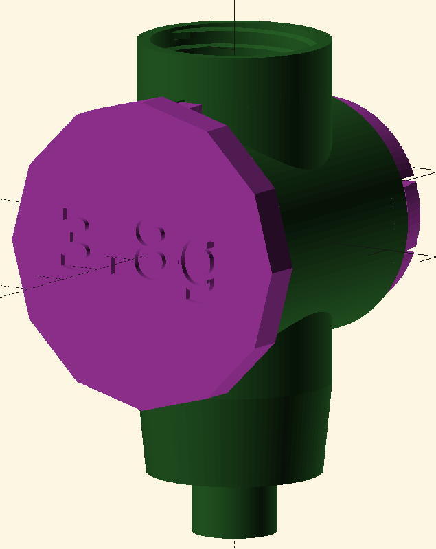

This repository contains a model for a sugar dispenser. This is especially useful for homebrewers who want to do carbonization of their beer with sugar in bottles. For this different models for different amounts of sugar are available.

The sugar dispenser is designed to be screwed on a PET bottle and does not have a own funnel at the top. It also comes with replacable dispenser sizes that can be combined with the body part.

## Available models
| Amount (g)   | For    | Density (kg/l) |
|--------------|--------|----------------|
| 2.3          | Sugar  | 1.02           |
| 2.5          | Sugar  | 1.02           |
| 2.8          | Sugar  | 1.02           |
| 2.9          | Sugar  | 1.02           |
| 3.3          | Sugar  | 1.02           |
| 3.5          | Sugar  | 1.02           |
| 3.8          | Sugar  | 1.02           |
| 4.2          | Sugar  | 1.02           |
| 5.7          | Sugar  | 1.02           |

# Contribute
For further dispenser sizes just extend the above table. For other contributions the OpenSCAD files are part of the repository.

For easy setup you can use the devcontainer provided. It has all the necessary libraries and openscad installed. All you need is docker installed and visual studio code to get started. Of course you can also use openSCAD directly if you prefer. For this you need to install the libraries from here: [installLibraries.sh](./.devcontainer/installLibraries.sh)

